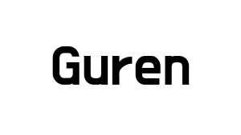

<p align="center">
  
  
  
</p>

# 📖 Sommary
* [Description](#Description)
* [Installation](#Installation)
* [Features](#Features)


# 📝 Description
Guren is an encoding type recognizer, it allows you to perform attacks on an unknown encoding type, and encodes/decodes data with different formats of encoding methods.


# 💻 Installation
> How to install ?
```
git clone https://github.com/D0pp3lgang3r/Guren.git
pip3 install -r requirements.txt
python3 guren.py --help
```

# 🔧 Features
  
  - Encryptions :
    - Caesar
    - Braille
    - Deadfish
    - Brainfuck
    - Netbios
    - Cloudflare
    - RC4
    - Polybe
    - Vigenere
    - Xor
    - Bin
    - Hex
    - Dec
    - Bacon
    - Morse Code
    - URL
    - DNA
    - T9-SMS
    - RailFence
    - Base32
    - Base45
    - Base58
    - Base62
    - Base64
    - Base85
  
 -  Additional Tools :
    - Brute force encodings  
    - Hash Analyser
